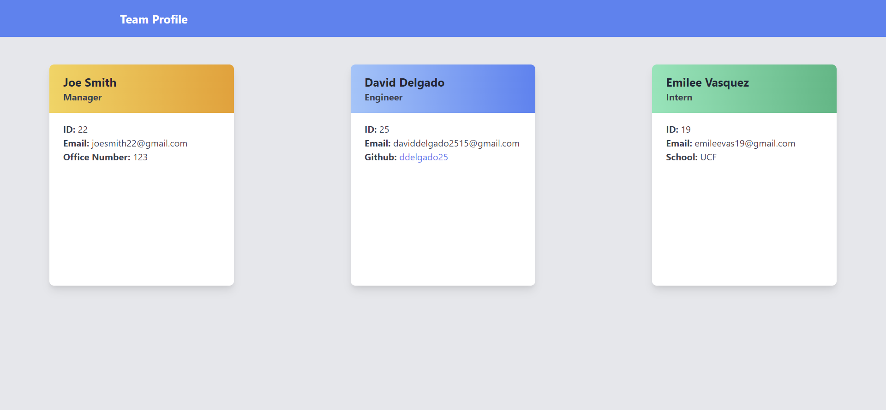

# Team Profile Generator - Module 10 Challenge

## Description

This is a command line node application that allows the user to generate a team profile through the command line by simply answering questions. The user can build a team with a Manager, Engineer , or intern. The user can succesfully generate a HTML team page with cards that include information of each individual team member using this application.

## Table of Contents

- [Installation](#installation)
- [Usage](#usage)
- [Credits](#credits)
- [License](#license)

## Installation

- Install node packages using "npm i" in the command line
- Install inquirer package using "npm i inquirer@8.2.4". This is what allows to use user prompts.
- To run the application use "node index" in the command line and the user will be prompted with first quesiton.

## Usage

Preview of fully generated team page. 

Link to video demo of application.

https://drive.google.com/file/d/1CrJgITZthd6CPV3ucHxYBuEr-G85xKEE/view

## Credits

Node.js for command line applicaiton
https://nodejs.org/en/

Tailwind CSS for overall styling of the page.  
https://tailwindcss.com/

## License

Please refer to the LICENSE in the repo.

---